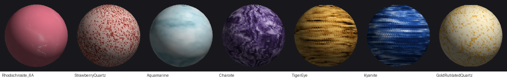

# gem-bead-to-glb

[](https://github.com/GrandAbigail/gem-bead-to-glb/actions/workflows/ci.yml)

An [Agent Skill](https://docs.claude.com/en/docs/agents-and-tools/agent-skills/overview)
that turns a photo of a gemstone bead into a `.glb` you can drop straight into a
three.js jewellery configurator — correct diameter, a real stringing hole, and a
PBR material whose colour, finish and internal pattern match the stone.



*Rendered in three.js with an environment map — no post-processing.*

None of these is a photo wrapped onto a sphere. Each texture is generated from
a description of the mineral's structure, which is why it survives being
rotated, tiled and lit from any angle.

## Why not just wrap the photo?

A flat product photo cannot be mapped onto a sphere without a visible seam and
polar distortion, and it bakes in the lighting of whatever room it was shot in.
So the skill takes a different route: **read the photo, decide what kind of
structure the stone has, and synthesise a texture with that structure.**

That turns "make a 3D model of this stone" into a small set of decisions a
model can actually make from an image — three colours, a pattern family, how
translucent, how glossy — and everything downstream is deterministic.

## What's in the box

| file | role |
|---|---|
| `SKILL.md` | the decision path — workflow, flag table, pointers |
| `references/materials.md` | the appearance knowledge base: pattern selection, the four principles, failure modes indexed by complaint, worked recipes |
| `references/strand-and-budget.md` | stringing beads onto a bracelet, and what it costs |
| `scripts/generate_bead_glb.py` | the generator (stdlib + NumPy + Pillow) |
| `scripts/validate_glb.py` | structural + material validation |
| `scripts/render_preview.py` | flat-shaded sanity render |
| `scripts/make_viewer.py` | comparison page with a correct environment map |
| `scripts/make_strand_demo.py` | 20 beads on a cord with per-bead randomisation |

No npm, no three.js, no glTF library. `generate_bead_glb.py` writes the GLB
container by hand, so it runs anywhere Python does — including sandboxes where
package installs are blocked.

## Install

```bash
git clone https://github.com/GrandAbigail/gem-bead-to-glb.git
```

Copy the `gem-bead-to-glb/` folder into your skills directory:

- **Claude Code / Cowork (personal):** `~/.claude/skills/`
- **Project-scoped:** `.claude/skills/` in the repo
- **Claude.ai:** Settings → Capabilities → Skills → upload the packaged
  `.skill` file (`python3 build_skill.py` produces one)

The skill triggers on its own when you share a photo of a bead or crystal and
ask for a 3D model or `.glb`.

## Use it directly

The scripts work standalone, without an agent:

```bash
python3 gem-bead-to-glb/scripts/generate_bead_glb.py \
  --color "#eecf8a" --pattern-color2 "#faeecb" --pattern-color3 "#eeb03c" \
  --pattern speckle --pattern-scale 4 \
  --speck-count 6500 --speck-size 55 --speck-aspect 100 \
  --speck-cluster 0.12 --speck-align 0.9 \
  --metallic-inclusions dark --metallic-threshold 0.40 \
  --frosted --roughness 1.0 --translucent --transmission 0.80 --ior 1.54 \
  --attenuation-color "#eec070" --attenuation-distance-mm 18 --thickness-mm 4.5 \
  --diameter-mm 8 --hole-diameter-mm 1.2 --segments 96 --texture-size 1024 \
  --out rutilated.glb --name "GoldRutilatedQuartz"

python3 gem-bead-to-glb/scripts/validate_glb.py rutilated.glb
python3 gem-bead-to-glb/scripts/make_viewer.py rutilated.glb "金发晶" --out preview.html
```

`references/materials.md` has worked recipes for the four stones above plus
tiger's eye, kyanite and gold rutilated quartz.

## Notes for consuming scenes

- **The drill channel runs along the mesh's local +Y.** Align local +Y with the
  cord tangent and the cord threads straight through.
- **Transmissive materials need an environment map.** `KHR_materials_transmission`
  has nothing to transmit in a bare scene, and a correct bead will look like dull
  grey plastic. Set `scene.environment` before concluding a file is wrong.
- **Textures are seamlessly tileable.** Give each bead instance a different UV
  offset (the *same* offset on every map) and one asset yields a strand of
  visibly different stones. See `references/strand-and-budget.md`.

## Requirements

Python 3.9+, NumPy, Pillow.

```bash
pip install numpy pillow
```

## Limitations

- Patterns are synthetic. Good for "this is convincingly that mineral", not for
  reproducing one specific photo's exact veining.
- Colour and finish come from a visual read, not material scanning.
- Inclusions are painted into the texture, not modelled as geometry. Modelling
  them as real geometry inside a transmissive shell was prototyped and
  abandoned — it depends on renderer-specific screen-space transmission
  behaviour and did not pay for its complexity.

## License

MIT — see [LICENSE](LICENSE).
